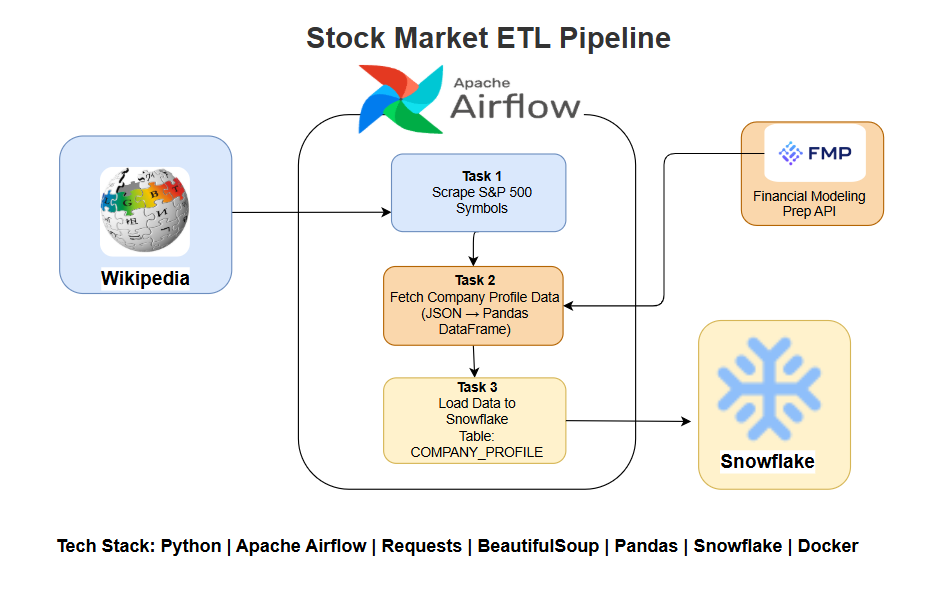
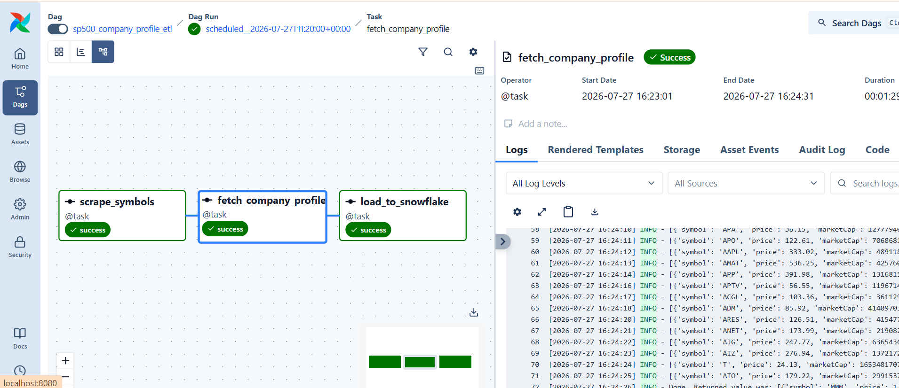
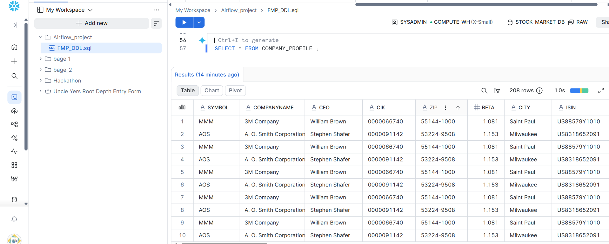

# 📈 Stock Market ETL Pipeline

An end-to-end ETL pipeline built with **Apache Airflow**, **Python**, and **Snowflake** that automates the extraction of S&P 500 company symbols, fetches company profile data from the Financial Modeling Prep (FMP) API, transforms the data into a Pandas DataFrame, and loads it into Snowflake.

---

## 📌 Project Overview

This project demonstrates a modern ETL workflow orchestrated using Apache Airflow.

The pipeline performs the following steps:

1. Scrapes S&P 500 company symbols from Wikipedia.
2. Fetches company profile information from the Financial Modeling Prep API.
3. Converts the API response into a Pandas DataFrame.
4. Loads the transformed data into a Snowflake table.
5. Runs automatically on a configurable Airflow schedule.

---

# 🏗️ Architecture




---

# ⚙️ Workflow

```
Wikipedia
      │
      ▼
Scrape S&P 500 Symbols
      │
      ▼
Financial Modeling Prep API
      │
      ▼
Fetch Company Profiles
(JSON → Pandas DataFrame)
      │
      ▼
Load to Snowflake
      │
      ▼
COMPANY_PROFILE Table
```

---

# 🛠️ Tech Stack

- Python
- Apache Airflow
- Requests
- BeautifulSoup
- Pandas
- Snowflake
- Docker
- WSL2

---

# 📂 Project Structure

```
stock-market-etl-pipeline/
│
├── dags/
│   └── FMP_pipeline.py
│
├── images/
│   └── architecture.png
|   └── Snowflake_output.png
|   └── Airflow_Dag.png
|
├── docker-compose.yaml
├── requirements.txt
├── .gitignore
└── README.md
```

---

# 📊 Data Source

### Wikipedia

S&P 500 Companies

https://en.wikipedia.org/wiki/List_of_S%26P_500_companies

---

### Financial Modeling Prep API

Company Profile Endpoint

https://site.financialmodelingprep.com/developer/docs

---

# 🗄️ Snowflake Table

Target Table

```
COMPANY_PROFILE
```

---

# ⏰ Scheduling

The DAG can be scheduled using Airflow Cron expressions.

Example:

At 08:30 on Every  Saturday

"30 8  * * 6"


or

```
@daily
```

---

# 🚀 Features

- Automated ETL Pipeline
- Airflow TaskFlow API
- Dynamic API Integration
- Pandas Data Transformation
- Snowflake Data Loading
- Dockerized Airflow Environment
- Easily Extendable Pipeline

---

# 📷 Airflow DAG



---

# ❄️ Snowflake Output



---

# 📈 Future Improvements

- Incremental Loading
- UPSERT / MERGE Support
- Data Validation
- Error Notifications
- Logging & Monitoring
- Unit Tests
- CI/CD using GitHub Actions

---

# 👨‍💻 Author

**Yousaf Umer**

Computer Science Graduate

Aspiring Data Engineer

Karachi, Pakistan

GitHub:
https://github.com/yousafumer

LinkedIn:
https://www.linkedin.com/in/yousaf-umer-558102214/

Email:
yousafumer128@gmail.com